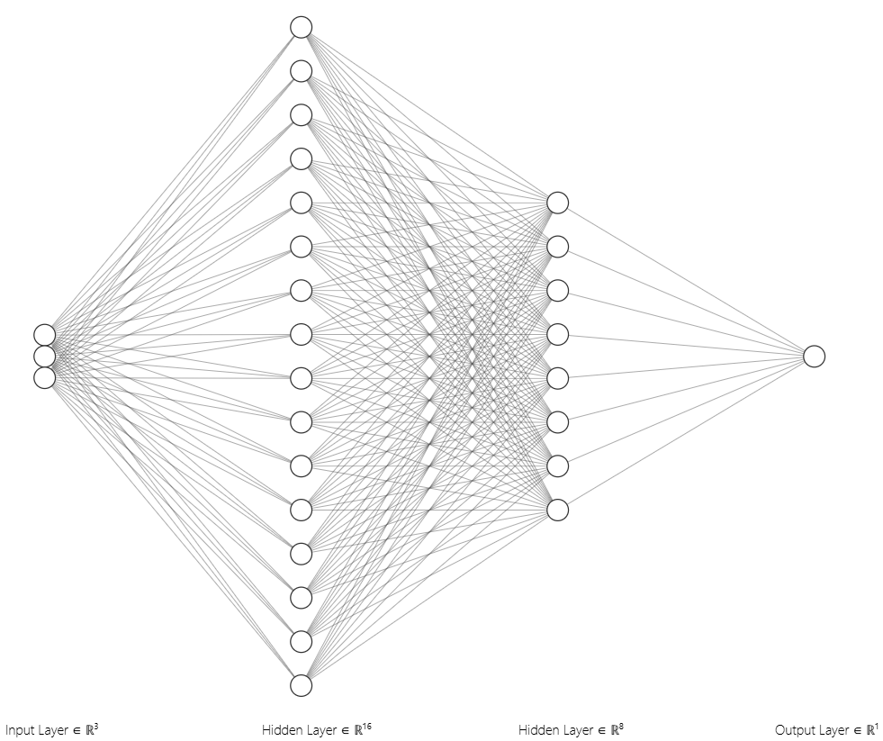

# GeneticFlappyNN

Simple genetic algorithm combined with a neural network (implemented in PyTorch) to evolve agents (birds) which learn to navigate through pipes, to make an AI that can learn to play FlappyBird. The network processes 3 inputs (Distance of bird to top pipe, bottom pipe, and horizontal distance to the pipe) through 2 hidden layers, size 16 and 8, output is one node with a sigmoid that predicts whether the bird should flap or not. Over multiple generations the algorithm selects the best performing birds based on fitness and breeds new models via crossover and mutation.

## Generation Videos

<div style="display: flex; justify-content: space-around; align-items: flex-start;">
  <div>
    <h3>Early gen</h3>
    

https://github.com/user-attachments/assets/10e77bc5-b4f0-4e07-bcf0-26cd118919de


  </div>
  <div>
    <h3>Newest gen</h3>
    

https://github.com/user-attachments/assets/a1f7bfba-523b-48d9-bdb2-2f8d0a43f573


  </div>
</div>

## Overview

- **Game Mechanics:**  
  Simulates Flappy Bird where agents must learn when to flap and avoid obstacles (pipes) while moving through a scrolling level.
  
- **Genetic Algorithm:**  
  At the end of each generation (i.e. when all birds are dead), the system records the fitness (based on flight time or can be changed to x-distance) and evolves a new population using crossover and mutation of neural networks.

- **Neural Network:**  
  Each bird is controlled by a simple feedforward network implemented in PyTorch. The network takes three inputs (distance y from bird to top and bottom pipe and distance x from bird to pipe) and outputs a probability to flap.
  

### Crossover
The **crossover** method creates a new child model by combining the parameters of two parent networks. For each parameter tensor (i.e. weights and biases):

- A random mask is generated using `torch.rand_like`, with each element having a 50% chance of being selected.
- Each element of the child’s parameter is chosen from either parent based on the random mask.
- This process produces a network that is a mix of both parents and can potentially inherit strengths from each.

### Mutation
The **mutation** method introduces randomness to the network’s parameters to maintain diversity in the population and to explore new solutions. For each parameter tensor in the network:

- A random mutation mask is generated with a given mutation rate (e.g., 10%).
- Random noise (scaled by a mutation strength factor) is added to each element where the mutation mask is true.
- This small perturbation helps avoid local minima and can lead to novel network behaviors when evolving.


### Visualization & Charting:
  A simple table on-screen tracks the generation number and score over time.

## Requirements

- Python 3.8+
- [PyTorch](https://pytorch.org/get-started/locally/)
- [Pygame](https://www.pygame.org/)
- Other standard libraries (asyncio, random, math)

## Installation

1. **Clone the repository:**
   ```sh
   git clone https://github.com/yourusername/GeneticFlappyNN.git
   cd GeneticFlappyNN
   ```

2. **Set up your virtual environment (optional but recommended):**
   ```sh
   python -m venv venv
   venv\Scripts\activate   # On Windows
   # or
   source venv/bin/activate   # On macOS/Linux
   ```

3. **Install dependencies:**
   ```sh
   pip install torch pygame
   ```

## Running the Project

To start the simulation and training of the genetic algorithm, simply run:

```sh
python Flappy.py
```

The simulation window will open displaying the game. The genetic algorithm continuously evolves based on agents’ performance. You’ll see a small chart in the top-right displaying the most recent generation and score.

## Customization

- **Hyperparameters:**  
  Adjust variables such as `NUM_BIRDS`, `FLAP`, `GRAVITY`, `PIPE_SPEED`, and FPS within `Flappy.py`.

- **Genetic Algorithm Settings:**  
  Modify the selection ratio (e.g. top 1%), mutation rate, and mutation strength in the `next_generation()` function.

- **Neural Network:**  
  The architecture can be altered in `NeuralNetwork.py`.

## Future Improvements

- Add visualizations to compare performance over generations.
- Save/load trained models.
- Integrate user controls to toggle between training and manual play.

## Acknowledgments

- Inspired by the classic Flappy Bird game.
- Built using PyTorch and Pygame.
